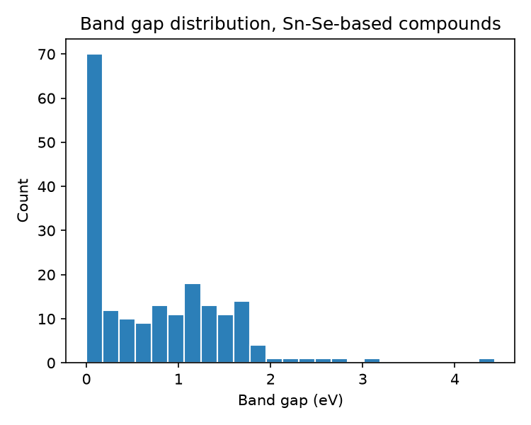

**Capstone Project — Machine Learning for Materials and Metallurgical Engineering**
**UGC Malaviya Mission Teacher Training Programme, 13–18 July 2026**

**Group members and roles:**

| Name | Role | Institution |
|---|---|---|
| Dr. Prashant Shahi | Group Leader & Modeling Lead | Deen Dayal Upadhyaya Gorakhpur University |
| Mrs. Akanksha | Data Lead | Chaudhary Charan Singh University, Meerut |
| Dr. Santosh Kumar | Preprocessing Lead | Era University |
| Mrs. Alfiya Mahmood | Report Lead | Era University |
| Dr. Nagendra Kumar Singh | Presentation Lead | Era University |

*Roles as agreed among group members; please confirm/adjust before submission.*

---

## 1. Problem Statement

Single-crystal SnSe is one of the best-performing thermoelectric materials discovered in the last decade, and its narrow, doping-tunable band gap is central to its performance: the right gap and band structure enable the high Seebeck coefficient and low thermal conductivity that make a material a good thermoelectric. Materials scientists routinely explore doping and alloying SnSe (with Pb, Ge, S, Te, Ag, Na, halides, and others) to engineer this gap — a process traditionally guided by expensive DFT calculations or trial-and-error synthesis.

This project asks: **can a simple, composition-only machine learning model predict whether a Sn-Se-based compound is a metal or an insulator, and if an insulator, predict its band gap — using only elemental composition, without any DFT calculation or crystal structure input?** A model like this would let researchers rapidly triage candidate dopants/alloys before committing computational or experimental resources.

## 2. Dataset

- **Source:** The Materials Project (materialsproject.org), queried live via the `mp-api` Python client.
- **Query scope:** all computed compounds containing **both Sn and Se** (the SnSe binary system plus any ternary/quaternary/quinary doped or alloyed derivative, e.g. Sn-Se-Pb, Sn-Se-S, Sn-Se-Ag), 2–7 elements.
- **Raw size:** 220 entries. **After removing duplicate formulas and missing band-gap values:** 192 unique compounds.
- **Target variable:** `band_gap` (eV), as computed by DFT and stored in the Materials Project database.
- **Class balance:** 136 insulators (`band_gap` > 0, 71%) vs. 56 metals (`band_gap` = 0, 29%).
- **Features:** each compound's formula was converted to a `pymatgen.Composition` object and featurized with matminer's `ElementProperty.from_preset("magpie")`, producing 132 composition-derived descriptors (statistics — mean, range, average deviation, etc. — of electronegativity, atomic radius, valence electron counts, melting point, and other elemental properties). No crystal-structure information was used, only chemical formula.

**Note on dataset size:** 192 compounds is small relative to 132 features. This is a real, verified constraint (not an estimate) — we queried the live API rather than assuming a larger dataset. We address it methodologically in Section 3 rather than by inflating the dataset with unrelated compounds.

## 3. Method

Two modeling stages, both using the course's regression/classification/Random Forest techniques:

**Stage 1 — Classification (metal vs. insulator).** Target: `is_metal = 1` if `band_gap == 0`, else `0`. Two models compared:

- Logistic Regression (features standardized first)
- Random Forest Classifier (300 trees)

**Stage 2 — Regression (band gap magnitude).** Restricted to the 136 insulators. Model: Random Forest Regressor (300 trees), predicting `band_gap` (eV) from the same 132 Magpie features.

**Evaluation.** Because the dataset is small (192 compounds, 136 for regression), a single 80/20 train/test split gives a noisy performance estimate — different random splits can shift accuracy or R² substantially. We therefore report **5-fold cross-validation** (mean ± standard deviation across 5 splits) as the primary metric, alongside the single-split result for reference. All models use a fixed random seed (42) for reproducibility.

**Interpretation.** Random Forest feature importances were extracted from the regression model to identify which elemental descriptors most influence predicted band gap.

## 4. Results and Discussion

### 4.1 Classification: metal vs. insulator

| Model | Single 80/20 split accuracy | 5-fold CV accuracy (mean ± std) |
|---|---|---|
| Logistic Regression | 0.744 | 0.781 ± 0.065 |
| Random Forest | 0.846 | **0.802 ± 0.037** |

Random Forest outperforms the linear baseline and is more stable across folds (lower std). The single-split number for Random Forest (0.846) looks better than the cross-validated one (0.802) — this is exactly the small-N noise the cross-validation is meant to catch, and it is the 0.802 figure we treat as the honest estimate.

The confusion matrix shows the model rarely confuses the majority class (insulators) but has more difficulty with the minority class (metals, only 56/192 compounds) — a direct consequence of class imbalance, not a modeling error.

### 4.2 Regression: band gap magnitude (insulators only)

| Evaluation | MAE (eV) | R² |
|---|---|---|
| Single 80/20 split | 0.414 | 0.279 |
| 5-fold CV (mean ± std) | **0.357 ± 0.072** | **0.401 ± 0.168** |

An MAE of ~0.36 eV against a band gap range of roughly 0–4.4 eV (median ≈ 0.6 eV) is a modest but genuine predictive signal — well above a naive "always predict the mean" baseline, but far from a substitute for DFT. The R² of 0.40 (with substantial spread across folds, ± 0.17) reflects the small sample size: composition-only features capture some but not all of the physics governing band gap in this family.

### 4.3 Feature importance

The single most important feature is the **range of electronegativity** across a compound's constituent elements, followed by electronegativity-related and periodic-column features. This is physically sensible: in IV-VI chalcogenides, band gap opening under doping/alloying is strongly tied to how much the dopant's electronegativity differs from Sn and Se, since this drives ionic/covalent bonding character and orbital energy mismatch — a mechanism well documented in the SnSe band-engineering literature.

### 4.4 Limitations

- **Composition-only features cannot distinguish polymorphs.** SnSe itself has multiple phases (e.g. room-temperature orthorhombic *Pnma* vs. the high-temperature phase); a formula-only featurization assigns them identical features despite different band gaps. This is a known ceiling on this approach's accuracy.
- **Small, heterogeneous dataset.** 192 compounds span binary SnSe through 6-element alloys — a genuinely diverse "family" rather than a single tunable system, which likely limits both models.
- **Class imbalance** (71/29 insulator/metal split) makes minority-class (metal) predictions less reliable, as seen in the confusion matrix.

## 5. Conclusions

A composition-only Random Forest model can distinguish Sn-Se-based metals from insulators with ~80% cross-validated accuracy, and predict the band gap of insulating members with a mean error of ~0.36 eV — a useful, fast first-pass screen for candidate dopants/alloys before committing to DFT or experiment, though not a replacement for either. Electronegativity-related descriptors dominate the model's predictions, consistent with known band-engineering mechanisms in IV-VI chalcogenides. The main path to a stronger model is adding structural (not just compositional) features to resolve polymorphs, and/or growing the dataset by relaxing to the broader IV-VI chalcogenide family (SnS, SnTe, PbSe, PbS, PbTe, GeSe, GeS, GeTe and their alloys).

## 6. Individual Contributions

*Draft — please confirm and edit to reflect what each person actually did.*

| Name | Contribution |
|---|---|
| Dr. Prashant Shahi | Chose topic and dataset, coordinated the group, built and ran the modeling notebook (classification + regression + cross-validation) |
| Mrs. Akanksha | Sourced and queried the Materials Project dataset |
| Dr. Santosh Kumar | Cleaned the data (de-duplication, missing values) and built the composition/feature pipeline |
| Mrs. Alfiya Mahmood | Wrote and formatted this report |
| Dr. Nagendra Kumar Singh | Built the slide deck and prepared the presentation |

## 7. Code / Notebook

Working notebook and full project files: https://github.com/ShahiDDU/snse-bandgap-ml-capstone
