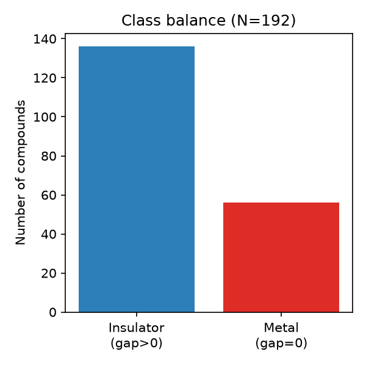
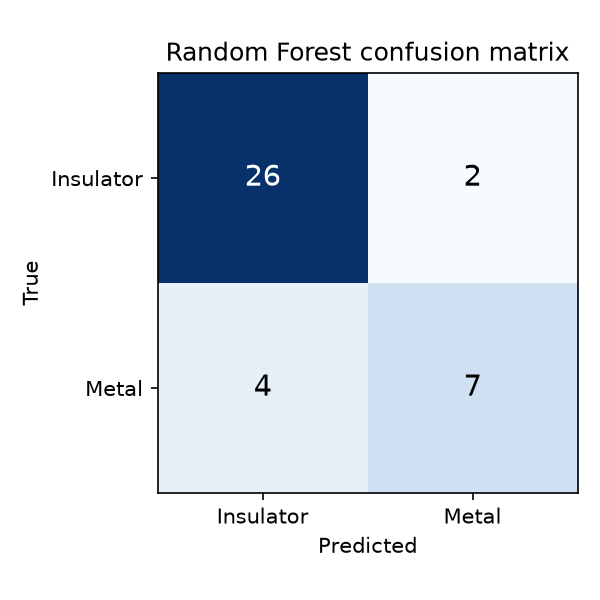
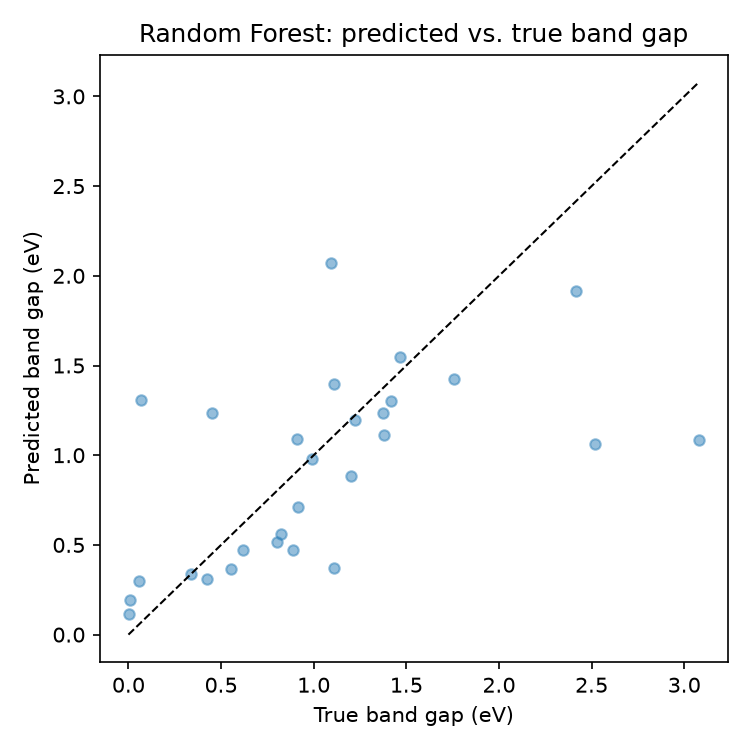
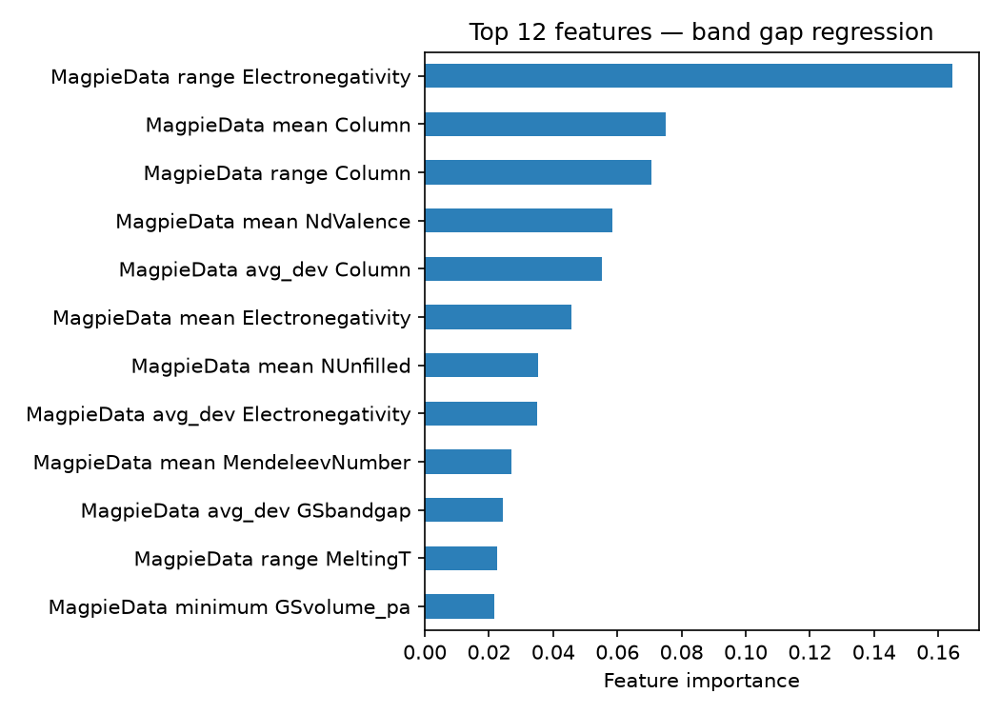

# Problem & Motivation

- SnSe is among the best-performing thermoelectric materials found in the last decade
- Its narrow band gap is doping/alloying-tunable — "band engineering" is an active research question (Pb, Ge, S, Te, Ag, Na, halide dopants)
- DFT is accurate but expensive; can composition alone give a fast first-pass screen?
- **Question:** from formula alone, can ML predict (1) metal vs. insulator, and (2) band gap magnitude, for Sn-Se-based compounds?

# Data

- Source: **Materials Project API**, queried live for all compounds containing both Sn and Se (binary SnSe plus doped/alloyed ternaries–hexanaries)
- 220 raw entries → **192** after de-duplication / cleaning
- Features: **132 Magpie composition descriptors** (matminer), from formula only — no crystal structure
- Class balance: **136 insulators / 56 metals** (71% / 29%)

{width=45%}

# Method

- **Stage 1 — Classification:** metal (`gap=0`) vs. insulator (`gap>0`)
  - Logistic Regression vs. Random Forest (300 trees)
- **Stage 2 — Regression:** Random Forest on the 136 insulators, predicting band gap (eV)
- Dataset is small relative to 132 features → **5-fold cross-validation** used for headline metrics, not a single train/test split
- Fixed random seed (42) throughout for reproducibility

# Results: Classification

- 5-fold CV accuracy — **Random Forest: 0.802 ± 0.037**
- 5-fold CV accuracy — Logistic Regression: 0.781 ± 0.065
- Random Forest is both more accurate and more stable across folds

{width=42%}

# Results: Regression

- 5-fold CV MAE — **0.357 ± 0.072 eV** (band gaps span ~0–4.4 eV, median ≈0.6 eV)
- 5-fold CV R² — 0.401 ± 0.168
- Modest but genuine signal from composition alone; single-split numbers were less reliable (small N)

{width=42%}

# Conclusions

- Composition-only Random Forest reaches **~80% accuracy** classifying metal vs. insulator, and **~0.36 eV MAE** predicting band gap of insulators — a useful fast screen, not a DFT replacement
- Top predictive feature: **range of electronegativity** across a compound's elements — physically consistent with known SnSe band-engineering mechanisms
- Limitation: composition-only features can't distinguish polymorphs (e.g. SnSe's room-temp vs. high-T phase)
- Next step: add structural features, or extend to the full IV-VI chalcogenide family for more data

{width=55%}
